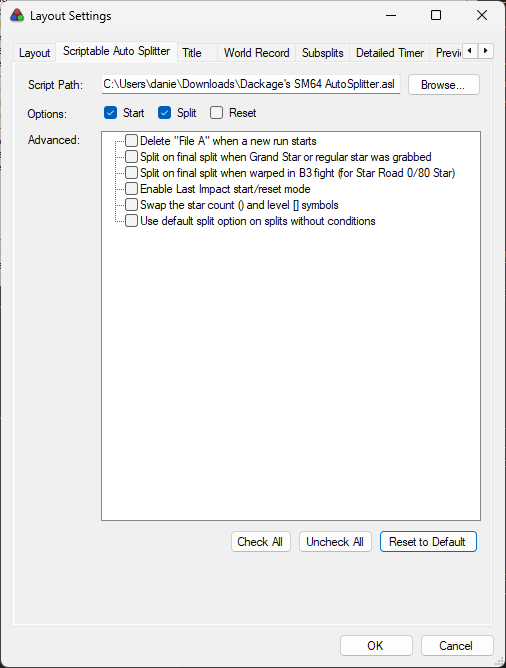

# Dackage's SM64 LiveSplit AutoSplitter

Wanting to add the ability to use course labels, I looked into making my autosplitter version. This is
    functionally very similiar to aglab2's "LiveSplit.SuperMario64.asl" autosplitter and is what I built off of.
- https://github.com/aglab2/LiveSplitAutoSplitters

#### Main Features
- split on level entry: e.g. [C1] or [B1] or [WC] // See the course labels section for a complete list
- split on specific area: e.g. [C1:3] or [B1:2] // The area index starts at 1
- split on fadeout after star count: e.g. (20) or (53)
- split on fadeout after key get: e.g. "key 1 fight" or "bowser 1 key" // Use the word "key" somewhere
- split on reset: e.g. "star 1 + R" or "top star then reset" // Include "R" or "reset" somewhere
- split on Grand Star // See the advanced options in the livesplit layout
- in-game timer (this uses the number of drawn frames rather than the true in-game global timer)

#### Compatibility
- Any Project64 version
- Parallel Launcher

----------
## Setup
- Download the .asl file in [releases](https://github.com/Dackage353/Dackage-s-SM64-LiveSplit-AutoSplitter/releases)
- Add a "Scriptable Auto Splitter" to you LiveSplit layout. + -> Control -> Scriptable Auto Splitter
- Configure options for your run. It's recommended to turn off "reset" and "Delete File A..." until you are comfortable with the autosplitter

----------
## Common Issues

"It won't split"
- You can edit split names during the run and it will probably work.
- Check that conditions are separated by a space. Like "star (1)" and not "star(1)"
- Note that the main autosplitter version won't work on decomp hacks. These need a custom autosplitter version for each hack.

"Keys aren't working"
- Keys only work on File A at the moment. I want to fix this eventually

"How to split on toad stars"
- The splitter waits for an area change by default to split. It's recommended to do it this way for accurate golds.
- If you wish, you can split on star grab or xcam by adding -g or -x to the split name e.g. "toad star (32) -g"

----------
## Course Labels

The easiest way to find level id's is probably STROOP. Decomp hacks won't work.
- https://github.com/SM64-TAS-ABC/STROOP
- Add the "Misc" tab if it isn't there already, then look for "Stage Index."
- Then you can match that number with the numbers below.

These are the course labels included by default. They are not case sensitive
- 9 (0x09): "Course 1", "C1", "C01" // Bob-omb Battlefield
- 24 (0x18): "Course 2", "C2", "C02" // Whomp's Fortress
- 12 (0x0C): "Course 3", "C3", "C03" // Jolly Roger Bay
- 5 (0x05): "Course 4", "C4", "C04" // Cool, Cool Mountain
- 4 (0x04): "Course 5", "C5", "C05" // Big Boo's Haunt
- 7 (0x07): "Course 6", "C6", "C06" // Hazy Maze Cave
- 22 (0x16): "Course 7", "C7", "C07" // Lethal Lava Land
- 8 (0x08): "Course 8", "C8", "C08" // Shifting Sand Land
- 23 (0x17): "Course 9", "C9", "C09" // Dire, Dire Docks
- 10 (0x0A): "Course 10", "C10" // Snowman's Land
- 11 (0x0B): "Course 11", "C11" // Wet-Dry World
- 36 (0x24): "Course 12", "C12" // Tall, Tall Mountain
- 13 (0x0D): "Course 13", "C13" // Tiny-Huge Island
- 14 (0x0E): "Course 14", "C14" // Tick Tock Clock
- 15 (0x0F): "Course 15", "C15" // Rainbow Ride
- 16 (0x10): "Overworld 1", "OW1" // Castle Grounds
- 6 (0x06): "Overworld 2", "OW2" // Inside Castle
- 26 (0x1A): "Overworld 3", "OW3" // Castle Courtyard
- 17 (0x11): "Bowser Course 1", "Bowser 1", "BC1", "B1" // Bowser in the Dark World (Course)
- 19 (0x13): "Bowser Course 2", "Bowser 2", "BC2", "B2" // Bowser in the Fire Sea (Course)
- 21 (0x15): "Bowser Course 3", "Bowser 3", "BC3", "B3" // Bowser in the Sky (Course)
- 30 (0x1E): "Bowser Fight 1", "Fight 1", "BF1", "F1" // Bowser in the Dark World (Fight)
- 33 (0x21): "Bowser Fight 2", "Fight 2", "BF2", "F2" // Bowser in the Fire Sea (Fight)
- 34 (0x22): "Bowser Fight 3", "Fight 3", "BF3", "F3" // Bowser in the Sky (Fight)
- 28 (0x1C): "Metal Cap", "MC" // Cavern of the Metal Cap
- 29 (0x1D): "Wing Cap", "WC" // Tower of the Wing Cap
- 18 (0x12): "Vanish Cap", "VC" // Vanish Cap Under the Moat
- 27 (0x1B): "Secret Level 1", "Secret 1", "SL1", "S1" // The Princess's Secret Slide
- 20 (0x14): "Secret Level 2", "Secret 2", "SL2", "S2" // Secret Aquarium
- 31 (0x1F): "Secret Level 3", "Secret 3", "SL3", "S3" // Wing Mario over the Rainbow
- 25 (0x19): "Secret Level 4", "Secret 4", "SL4", "S4", "Cake", "End" // End Cake Picture

----------
## Arguments

Use these to handle when it will split after the condition is true.
- area: splits on an area change. This is the default behavior. Use -a or -area
- level: splits on a level change. Use -l or -level
- grab: splits on a star or key grab. Use -g or -grab
- xcam: splits on the xcam after a star or key grab. Use -x or -xcam
- classic: splits on a level change or after Mario's star dance animation ends. Useful on stars that warp you
    back to the same level. Use -c or -classic

----------
## ASL File Customization

There are additional settings you can customize by editing the .asl file
- any basic text editor will do, but I've been using VS Code. If you do, you can change the language to C#
    so that it's easier to read.
- .asl uses C# code (.NET Framework 4.8.1)

The split option can be changed. By default it's "area" but you can also do level, grab, xcam, or classic.
- Look for: vars.SplitOption_Default = "area";
    
You can add or remove specific key or reset keywords. Look for:
- vars.ResetKeywords = new string[] { "R", "reset" };
- vars.KeyKeywords = new string[] { "key" };
    
You can add or remove course labels as desired. Note that different areas within a level share the
    same level id. Look for:
- #region Add course labels

----------
## Special Thanks

- DJ_Tala for help with testing
- aglab2 for the creation of the original and some help
